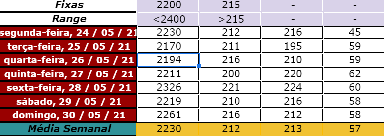
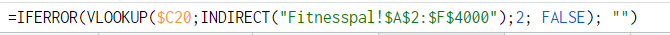
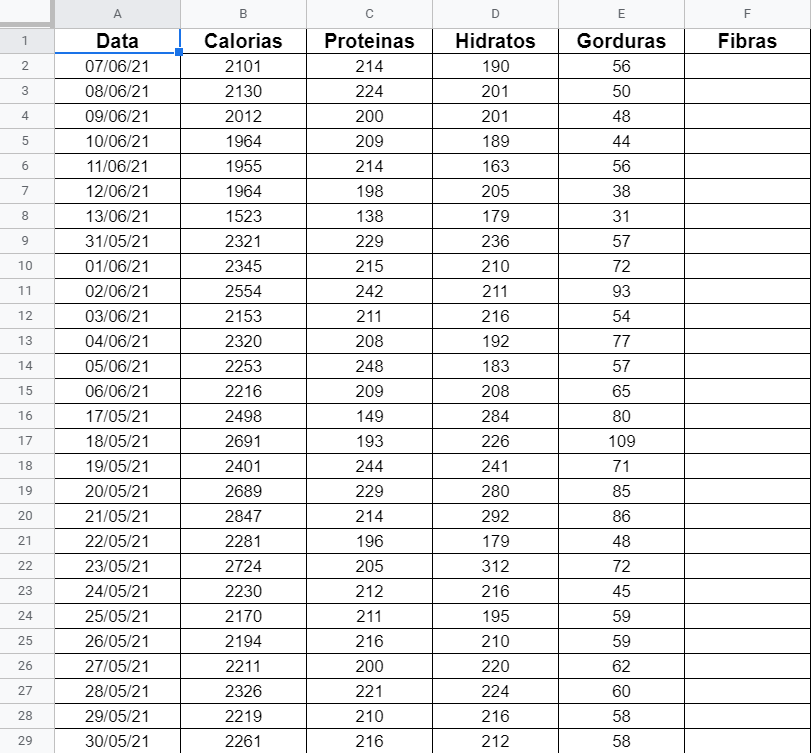

# Automated calories tracker

This script request data from an unofficial myfitnesspal API and uploads it into a google spreadsheet.

## Why

Manually handling data is boring, specially when you know it can somewhat be automated, so that's what I've done.

Many personal trainers these days use spreadsheets for each of their clients, the client is supposed to manually upload each day calories and macronutrients so the personal trainer can analyze the data.

## How

The user has to pass 2 or 3 parameters to the script:

1. The username of the client (The username must be exactly the same as in the myfitnesspal account)

2. The timeline for the requested data. It can be a single value in the form of yyyy/mm/dd or in a range in the format of yyyy/mm/dd yyyy/mm/dd (in this case the date must be in ascing order)

Exaple:

```
python myfitnesspal.py nuno_c11 2021/01/01 2021/01/29
```


## Increasing efficiency

For this script to be more efficient and productive, the spreadsheet should have a sheet with some formulas that fetch data from another sheet, this way nothing else has to be done in order for the data to be analyzed.

Example of weekly calories stats:



Example of a google sheet formula that gets data from Fitnesspal sheet:



Example of the sheet where the script will export the data to:



## Current issues

The API used does not support fibres import, this way we can only fetch proteins, carbs and fats.
